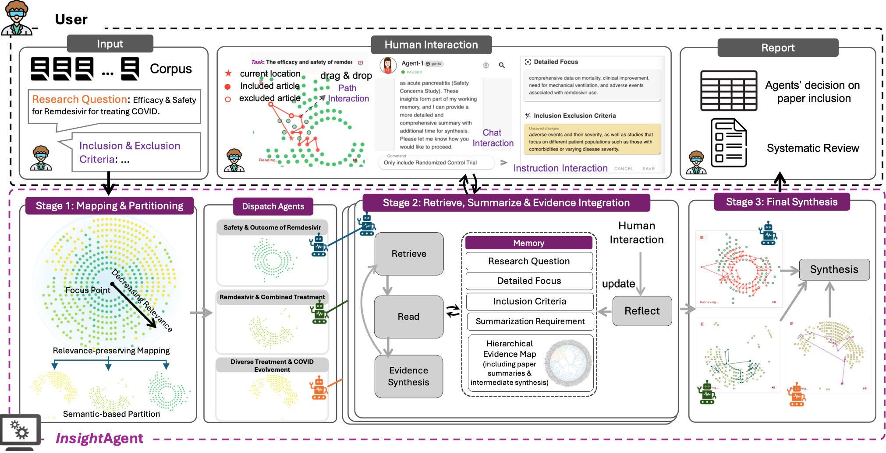

<p align="center">
  <a href="https://github.com/RyanQ96/InsightAgent/tree/local-dev">
    
  </a>
</p>

   
*Figure 1: Overall framework of InsightAgent showing the multi-agent architecture and interactive interface.*

InsightAgent revolutionizes the systematic review process by using a human-in-the-loop approach powered by large language models. The system leverages a multi-agent design to partition a large literature corpus and synthesize high-quality reviews in hours rather than months. For more details, please see our paper  
[Revolutionizing Systematic Reviews with Interactive Agents: A Human-Centered Approach](LINK_TO_PAPER_PDF).


## Table of Contents
- [Table of Contents](#table-of-contents)
- [Overview](#overview)
- [Features](#features)
- [Requirements](#requirements)
- [Installation](#installation)
    - [1. Cloning the Repository](#1-cloning-the-repository)
    - [2. Installing Dependencies](#2-installing-dependencies)
- [Usage](#usage)
    - [Configuring Your Environment](#configuring-your-environment)
    - [Supported Data Format and Sample Data](#supported-data-format-and-sample-data)
    - [1. Starting the Firebase Emulators](#1-starting-the-firebase-emulators)
    - [2. Starting the Backend](#2-starting-the-backend)
    - [3. Starting the Frontend](#3-starting-the-frontend)
- [Workflow Overview](#workflow-overview)
- [Contact \& Citation](#contact--citation)


## Overview

InsightAgent is designed to assist researchers in performing systematic literature reviews with speed and precision. By incorporating interactive AI agents and a user-friendly interface, InsightAgent enables users to:
- **Map and partition** a vast corpus of literature with a radial-based similarity and relevance display.
- **Utilize multiple agents** for parallel reading and incremental evidence synthesis.
- **Interact with the agents** in real-time to guide and refine the synthesis process.
- **Visualize provenance and synthesis pathways** to ensure traceability and transparency.

This approach drastically reduces review time and enhances the quality of systematic reviews, achieving near-human quality in significantly less time.


## Features

- **Rapid Evidence Synthesis**: Complete systematic reviews in hours.
- **Multi-Agent Design**: Parallel processing of literature using multiple AI agents.
- **Interactive Interface**: Real-time user oversight via drag-and-drop, chat-based, and instruction-based interactions.
- **Traceable Results**: Detailed provenance tracking for each synthesized finding.
- **Visual Analytics**: Radial maps and hierarchical evidence structures to explore and verify findings.


## Requirements

- **Node.js (v20 or later)**  
  [Download Node.js](https://nodejs.org/en/download)  
  We recommend managing Node versions using [nvm](https://github.com/nvm-sh/nvm).

- **Python (3.12 or later)**  
  Ensure that `python3.12` is installed and available on your system. This is required for Firebase Functions and backend services.

- **Firebase Tools (Local)**  
  Firebase Tools is added as a local dependency. Use `firebase emulators:start` to run the emulators.

- **Git (with recursive clone)**  
  Clone the repository with submodules:
  ```bash
  git clone --recursive https://github.com/OSU-NLP-Group/InsightAgent.git
  ```


## Installation

#### 1. Cloning the Repository

Clone the repo recursively to ensure all submodules are included:
```bash
git clone --recursive https://github.com/RyanQ96/InsightAgent.git
cd insightagent
```

#### 2. Installing Dependencies

We provide several installation scripts to ease setting up the project:

- **Backend Installation**  
  Run the backend installer:
  ```bash
  source install_backend.sh
  ```
  This script creates a virtual environment named `insightagent-venv` (in the root), installs backend dependencies from the `server` directory, and installs the ChatFlare submodule.

- **Frontend Installation**  
  Run the frontend installer:
  ```bash
  source install_frontend.sh
  ```
  This script checks for Node.js (v20 or later), installs frontend dependencies, and prepares the development environment.

- **Firebase Functions Installation**  
  Run the functions installer:
  ```bash
  source install_functions.sh
  ```
  This sets up the Python virtual environment for Firebase Functions in the `functions` folder (using Python 3.12) and installs its dependencies.

Alternatively, you can run an all-in-one installation script:
```bash
source install_all.sh
```
*(This script sequentially executes the backend, frontend, and functions installation scripts.)*


## Usage

Before starting the services, there are two key configurations:

#### Configuring Your Environment
Create or edit the <code>server/.env.config</code> file located in the server directory. This file allows you to configure language model settings, API keys, and additional domain-specific prompts. For example:
```dotenv
#===============================================================
# Language model
#===============================================================
LLM_MODEL_NAME=gpt-4o
LLM_TEMPERATURE=0.1
LLM_MAX_TOKENS=8192

#===============================================================
# API KEYS
#===============================================================
OPENAI_API_KEY=xxxxxxxxxxxxxxxx

#===============================================================
# DOMAIN_SPECIFIC_SUMMARY_PROMPT
#===============================================================
DOMAIN_SPECIFIC_SUMMARY_PROMPT="Your Domain Specific Requirement For Synthesis..."

#===============================================================
# Research Query
#===============================================================
Research_Query="Your Research Query here..."
...
```
Replace the OPENAI_API_KEY with your actual key and adjust other parameters as needed. For further details, please see the documentation within the <code>.env.config</code> file. For <code>DOMAIN_SPECIFIC_SUMMARY_PROMPT</code>, <code>Research_Query</code>, <code>Inclusion_Exclusion_Criteria</code>, you can config them directly in the config file, besides interactively modify them at the interface. You can find sample initial research query and criteria of each datasets in the table below.

#### Supported Data Format and Sample Data
InsightAgent currently supports corpus data input in **RIS file** format. An RIS file is a standard bibliographic citation file that contains article abstracts, citations, and metadata required for generating systematic reviews. Please ensure that your literature corpus is formatted as a <code>.ris</code> file.

We provide a few sample <code>.ris</code> files below, each representing a small test corpus. You can download them and try running InsightAgent with these samples:

| Name                                                                              | Download             | Corpus / Inclusion         | Config |
|-----------------------------------------------------------------------------------|---------------------------|----------------------------| ----------------------------|
| [Remdesivir for Patients with COVID-19 (2024)](https://pmc.ncbi.nlm.nih.gov/articles/PMC11372431/)            | [Download](assets/ris/covid-19.ris)   | 491 total / 9 included     | [file](assets/config/.env.config.Tan-Lim_2024_Among_Patients_with_COVID19)|
| [A systematic review on the impact of sub-epidermal (2024)](https://pubmed.ncbi.nlm.nih.gov/38832363/)           | [Download](assets/ris/sub-epidermal.ris)  | 712 total / 10 included  |[file](assets/config/.env.config.Avsar_2024_A_systematic_review_on_the_impact_of_subepidermal_moisture_assessments)|
| [Artificial Intelligence Support for Informal Patient Caregivers (2024)](https://pubmed.ncbi.nlm.nih.gov/38790350/) | [Download](assets/ris/ai.ris)   | 381 total / 10 included    |[file](assets/config/.env.config.Borna_2024_Artificial_Intelligence_Support_for_Informal_Patient_Caregivers-_A_Systematic_Review)|
| [Nutritional interventions for preventing (2024)](https://pubmed.ncbi.nlm.nih.gov/38345088/)                    | [Download](assets/ris/nutritional.ris)   | 72 total / 23 included     |[file](assets/config/.env.config.Langer_2024_Nutritional_interventions_for_preventing_pressure_ulcers)|

**To start the project after installation, follow these steps:**

#### 1. Starting the Firebase Emulators

Run the Firebase emulators (this includes authentication, database, functions, and storage):
```bash
npm run emulator
```
*(This command uses the local firebase-tools and starts the emulators as configured in your `firebase.json`.)*

#### 2. Starting the Backend

Activate the backend virtual environment and run the server:
```bash
source insightagent-venv/bin/activate
cd server
python app.py
```
Your backend server will start (typically at `http://127.0.0.1:8080`).  

#### 3. Starting the Frontend

From the project root (or the directory containing your frontend's `package.json`):
```bash
npm run dev
```
*(Alternatively, if you are using pnpm, run `pnpm run dev`.)*  
InsightAgent frontend will start (by default on `http://localhost:5173`).


## Workflow Overview

Once everything is running, here's a typical workflow for using InsightAgent:

1. **Open the Interface**:  
   Visit your frontend (e.g., `http://localhost:5173`) to access the interactive interface.

2. **Upload/Load Data Files**:  
   Load your literature corpus (e.g., ris files).  
   **

3. **Initiate the Review Process**:  
   - **Step 1: Map and Partition the Corpus**  
     The system generates a radial map where more relevant articles appear at the center.  
     **
   - **Step 2: Agent Interaction and Evidence Synthesis**  
     Multiple agents process clusters in parallel. Users can guide the agents using chat, drag-and-drop, or direct instructions.  
     **
   - **Step 3: Final Synthesis and Export**  
     Inspect the synthesized summary, verify citations, and export the final systematic review.  
     *[See Video Tutorial 4](#)*


## Contact & Citation

For inquiries, suggestions, or issues, please open an issue in this repository or contact the maintainers:

- **Maintainers**: Rui Qiu (qiu.580@osu.edu), Shijie Chen (chen.10216@osu.edu)

If you use InsightAgent in your research, please cite our paper:
```bibtex
@misc{qiu2025insightagent,
      title={Completing A Systematic Review in Hours instead of Months with Interactive AI Agents}, 
      author={Rui Qiu and Shijie Chen and Yu Su and Po-Yin Yen and Han-Wei Shen},
      year={2025},
      eprint={2504.14822},
      archivePrefix={arXiv},
      primaryClass={cs.HC},
      url={https://arxiv.org/abs/2504.14822}, 
}
```

